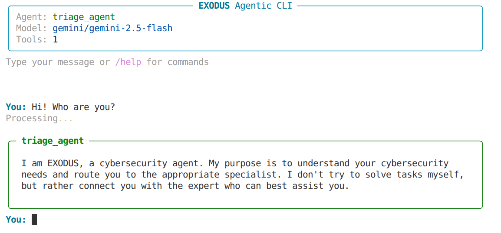

# EXODUS: Swarm Intelligence for Autonomous Cybersecurity

EXODUS is a lightweight, modular, open-source cybersecurity framework. Create and share your agents, add capabilities by creating plugins, and automate your agent teams for pentesting, reconnaissance, vulnerability discovery, and much more.

Key Features:

+ Use the model you want: support for DeepSeek, Ollama, Google, OpenAI, and more.
+ Modular architecture: easily create or use plugins to add functionalities to your agents.
+ Multi-agent swarm architecture: from individual agents to specialized teams with different patterns (central orchestrator, agent delegation, etc.)
+ Lightweight implementation: avoids heavy agent libraries and uses only what is strictly necessary.

---

<div align="center">

*Triage agent routing requests to specialized agents with seamless handoffs*
</div>

---

## 📋 Table of Contents

- [Installation & Setup](#-installation--setup)
- [Quick Start](#-quick-start)
- [Creating Custom Plugins](#-creating-custom-plugins)
- [Creating Custom Agents](#-creating-custom-agents)
- [Agent Handoffs](#-agent-handoffs)
- [Secure Execution Modes](#-secure-execution-modes)
- [Technical Highlights](#-technical-highlights)
- [Architecture](#-architecture)

## 🚀 Installation & Setup

### Prerequisites

- Python 3.11 or higher
- Docker (optional, for isolated execution mode)
- An API key for your chosen LLM provider (Google Gemini, OpenAI, etc.)

### Installation

```bash
# Clone the repository
git clone https://github.com/exodialabsxyz/exodus.git
cd exodus

# Install EXODUS
pip install -e .
```

### Initial Configuration

1. **Copy the example configuration:**
   ```bash
   cp settings.toml.example settings.toml
   ```

2. **Configure your LLM provider:**
   Edit `settings.toml` and add your API key:
   ```toml
   [llm]
   default_model = "gemini/gemini-2.5-flash"
   default_provider = "litellm"
   custom_api_base = ""  # Optional: for local models or custom endpoints
   
   [llm.default_provider_config]
   api_key = "your-api-key-here"
   ```

3. **Configure execution mode:**
   ```toml
   [agent]
   default_agent = "triage_agent"
   max_iterations = 100
   execution_mode = "local"  # or "docker"
   
   [agent.execution.docker]
   default_image = "parrotsec/security:7.0"
   default_image_name = "exodus_container"
   ```

4. **Set logging level:**
   ```toml
   [logging]
   level = "INFO"  # DEBUG, INFO, WARNING, ERROR
   format = "[exodus] %(asctime)s - %(name)s - %(levelname)s - %(message)s"
   ```

## ⚡ Quick Start

### Start a Chat Session

```bash
# Start with default agent
exodus-cli chat

# Start with a specific agent
exodus-cli chat --agent triage_agent

# Use a different model
exodus-cli chat --model "gemini/gemini-2.5-pro"

# Adjust temperature
exodus-cli chat --temperature 0.7
```

### Example Usage

```bash
# Start with the triage agent for automatic task routing
exodus-cli chat --agent triage_agent

> "Scan 192.168.1.1 for open ports and services"
# triage_agent will automatically transfer to recon_agent
# recon_agent will execute the scan and provide results
```

### Using Ollama (Local Models)

```toml
[llm]
default_model = "ollama/granite4:latest"
custom_api_base = "http://localhost:11434"

[llm.default_provider_config]
api_key = "ollama_apikey"
```

## 🔧 Creating Custom Plugins

Create powerful tools for your agents with just a simple decorator. EXODUS automatically generates the OpenAI-compatible schema:

```python
from exodus.core.decorators import tool

@tool(
    name="port_scanner",
    type="cli",
    description="Scans ports on a target host using nmap"
)
def port_scanner(target: str, ports: str = "1-1000") -> str:
    """Scans the specified ports on the target."""
    return f"nmap -p {ports} {target}"

# Register your plugin class
class SecurityPlugin:
    @staticmethod
    def get_tools():
        return {
            port_scanner.tool_name: port_scanner,
        }
```

To make your plugin discoverable, register it in your `pyproject.toml`:

```toml
[project.entry-points."exodus.plugins.tools"]
security = "your_package.plugins:SecurityPlugin"
```

EXODUS will automatically discover and load all plugins from the `exodus.plugins.tools` entry point group at startup.

**Plugin System:**
- **Python tools**: Execute code directly in your environment
- **CLI tools**: Return shell commands executed in isolated containers
- **Auto-validation**: Pydantic models generated automatically from type hints
- **Auto-discovery**: Plugins loaded via Python entry points (`exodus.plugins.tools`)
- **Distributable**: Share your plugins as PyPI packages

## 🤖 Creating Custom Agents

Define agents using simple TOML configuration files:

```toml
[agent]
name = "pentest_agent"
description = "Specialized agent for penetration testing"
system_prompt = "You are a pentesting expert. Analyze targets and find vulnerabilities."
tools = ["port_scanner", "linux_command", "core_echo"]
handoffs = ["web_expert", "network_expert"]  # Agents this agent can delegate to
max_iterations = 50

[agent.llm]
model = "gemini/gemini-2.5-pro"
temperature = 0.7
```

**Agent Configuration:**
- **Declarative**: Define behavior in TOML, no code needed
- **Tool selection**: Choose which capabilities each agent has
- **LLM settings**: Per-agent model and parameters
- **System prompts**: Customize agent personality and expertise
- **Agent handoffs**: Delegate tasks to specialized agents dynamically

## 🔄 Agent Handoffs

EXODUS supports **dynamic agent delegation** where agents can transfer control to other specialized agents during execution:

```toml
[agent]
name = "triage_agent"
description = "Routes requests to specialized agents"
system_prompt = "Analyze the user's request and delegate to the appropriate expert."
tools = []
handoffs = ["security_expert", "code_analyst", "recon_specialist"]

[agent.llm]
temperature = 0.3
```

**How it works:**
1. Agent analyzes the task and determines if another agent is better suited
2. Calls `transfer_to_{agent_name}` with a reason for the handoff
3. Target agent receives context and continues execution
4. Shared memory preserves conversation history across handoffs
5. Global `max_iterations` prevents infinite loops across all agents

**Example workflow:**
```
User: "Scan this webapp and find SQL injection vulnerabilities"
  ↓
triage_agent → Identifies security task
  ↓
transfer_to_security_expert(reason="Requires vulnerability assessment")
  ↓
security_expert → Scans target, finds issues, needs code review
  ↓
transfer_to_code_analyst(reason="Review vulnerable code patterns")
  ↓
code_analyst → Provides fix recommendations
```

**Benefits:**
- **Specialized expertise**: Each agent focuses on what it does best
- **Automatic routing**: LLM decides when to delegate based on task requirements
- **Seamless context**: Conversation flows naturally between agents
- **No orchestrator needed**: Agents self-coordinate through handoffs

## 🐳 Secure Execution Modes

EXODUS provides multiple execution drivers for running tools safely:

**Docker Mode** (Recommended for isolated execution):
```toml
[agent]
execution_mode = "docker"

[agent.execution.docker]
default_image = "debian:latest"
default_image_name = "exodus_container"
```

- Isolated environment using any Docker image (Debian, Ubuntu, Kali, ParrotSec, Alpine, etc.)
- Automatic container lifecycle management
- Safe execution of commands without affecting host system
- Perfect for security tools or untrusted code execution

**Local Mode**:
```toml
[agent]
execution_mode = "local"
```

- Direct execution in your environment
- Faster for trusted tools
- Use for development and testing

## 🐳 Exodus Security Executor Container

EXODUS provides a specialized Docker container that runs an `exodus-server` daemon for executing Python-based tools in an isolated ParrotSec environment. Agents can communicate with this server via Unix sockets to execute EXODUS tools remotely.

### Quick Start

```bash
# Build the image
docker build -t exodus-security-executor -f docker/exodus_security_executor/Dockerfile .

# Run the container
docker run -d --name exodus-executor exodus-security-executor

# View logs
docker logs -f exodus-executor
```

The container automatically starts the `exodus-server` on `/tmp/exodus/executor.sock` and loads the full EXODUS tool registry. This allows agents to execute Python tools in an isolated, security-focused environment.

For detailed documentation, communication protocols, and advanced usage, see [`docker/README.md`](docker/README.md)

## ⚡ Technical Highlights

EXODUS is built on **abstract, modular architecture** that enables endless possibilities:

- **Pluggable LLM Providers**: Abstract `LLMProvider` interface supports any model backend (LiteLLM, OpenAI, custom providers)
- **Extensible Memory Systems**: Implement your own `MemoryManager` (JSON, Redis, PostgreSQL, vector DBs)
- **Custom Execution Drivers**: Create new `ToolExecutionDriver` backends (Kubernetes, Lambda, SSH, etc.)
- **Plugin Registry**: Automatic tool discovery via Python entry points - share and reuse tools across projects
- **Tool Type System**: Define custom tool types beyond `python` and `cli`
- **Agent Orchestration**: Framework-ready for swarm patterns (hierarchical, collaborative, competitive)
- **Type Safety**: Pydantic models auto-generated from type hints
- **Async-First**: Built on asyncio for concurrent agent execution
- **Minimal Core**: Only `httpx` and `pydantic` - everything else is pluggable

## 📦 Architecture

```
Agent Engine
    ├── LLM Provider (LiteLLM, OpenAI, custom)
    ├── Memory Manager (JSON, Redis, custom)
    ├── Tool Executor
    │   ├── Tool Registry (plugin discovery)
    │   └── Execution Driver (Docker/Local/custom)
    └── Agent Definition (TOML config)
        └── Handoffs (dynamic agent delegation)
```

## 🔌 Supported LLM Providers

Thanks to LiteLLM integration, EXODUS supports 100+ LLM providers:

- **Google**: `gemini/gemini-2.0-flash-exp`, `gemini/gemini-pro`
- **OpenAI**: `gpt-4`, `gpt-3.5-turbo`, `gpt-4-turbo`
- **Anthropic**: `claude-3-opus`, `claude-3-sonnet`
- **Ollama**: `ollama/llama3.2`, `ollama/mistral`, `ollama/qwen3:latest`
- **DeepSeek**: `deepseek/deepseek-chat`, `deepseek/deepseek-coder`
- **And many more**: Groq, Cohere, Replicate, Together AI, etc.

Simply set the model in your configuration (using litellm):
```toml
[llm]
default_model = "provider/model-name"
```

## 🤝 Contributing

Contributions are welcome! Here's how you can help:

- **Report bugs**: Open an issue at https://github.com/exodialabsxyz/exodus/issues
- **Suggest features**: Share your ideas for improvements
- **Create plugins**: Build and share tools for the community
- **Improve docs**: Help make EXODUS more accessible
- **Submit PRs**: Fix bugs or add features

Visit our GitHub: https://github.com/exodialabsxyz/exodus

## 📝 License

**EXODUS Core Framework is free and open source** under the [MIT License](LICENSE).

**You CAN:**
- Use commercially without restrictions
- Modify and distribute freely
- Create and sell plugins
- Build commercial products on top of EXODUS
- Use in production environments
- Fork and create derivatives

This includes the core framework, agent engine, CLI, plugin system, and all core components on this repository.

**Contact:** contact@exodialabs.xyz | **Website:** https://exodialabs.xyz

See [LICENSE](LICENSE) file for complete terms.

## ⚠️ Disclaimer

> **IMPORTANT**: EXODUS is a powerful cybersecurity tool. Use it responsibly.
> 
> The repository authors do not promote the misuse of this tool for criminal purposes, outside any regulation or law, which can cause serious harm. By downloading, using, or modifying the code, you accept the terms of the license and the aforementioned limitations on its use.
> 
> Always ensure you have proper authorization before testing or scanning any systems.

## 🔗 Resources

- **Website**: https://exodialabs.xyz
- **GitHub**: https://github.com/exodialabsxyz/exodus
- **Examples**: See `exodus/agents/single/` for agent examples
- **Issues & Discussions**: https://github.com/exodialabsxyz/exodus/issues
- **Contact**: contact@exodialabs.xyz

---

---

**EXODUS** - Made with ❤️ by AGP for the cybersecurity community

https://exodialabs.xyz |  contact@exodialabs.xyz | https://github.com/exodialabsxyz
